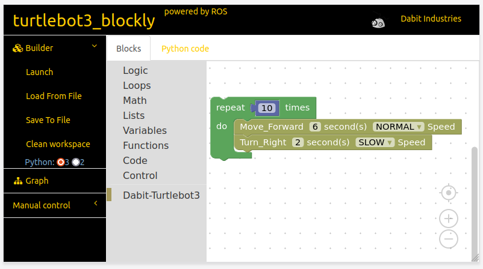
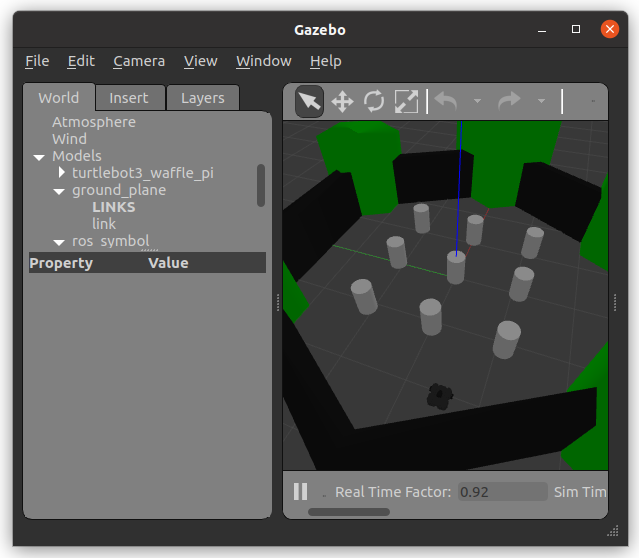

# Blockly for TurtleBot3 (BTB3)

<small>(This is a fork of [aravindk2604/turtlebot3_blockly](https://github.com/aravindk2604/turtlebot3_blockly) and is used to make changes to the original repository without affecting the original code.)</small>

In this project, the Blockly library is used to implement a visual editor and code generator for programming the TurtleBot3 (TB3) using the Robot Operating System (ROS). ROS is a extensible open source software framework for programming robots and other robotic devices.  
The Blocky-based editor is realized as a web-based application that can be accessed within any browser making it a platform-independent solution to visually programm the TB3.

Students can gain initial experience in robot programming and produce quick results by simple arranging blocks instead of using C++ or Python directly. The graphical blocks represent specific programming language constructs and at any time the corresponding Python code can be generated, observed, modified and executed.

Most of the components of the original "Blockly for TB3"-projects are outdated and do not work on newer systems, which is a pity.
So first and foremost, the goal of this project is to update the whole Blockly environment, the editor components, and to fix old bugs so that a TB3 can be programmed visually again.
Additionally, a more detailed user guide is provided and new features will be gradually introduced.

#### System Requirements

- Linux
- ROS Noetic
- Gazebo
- Python 3
  - [How to install Python 3 on Ubuntu](https://wiki.ubuntuusers.de/Python/)


#### Tested On

- Ubuntu 20.04.5 LTS

#### Sneak Peak of the UI

Programm a TB3 by just dragging and dropping blocks on the modeling grid.


## Getting Started with Blockly for TB3 (BTB3)

### Installation

Follow the three main steps to install BTB3. You may want to skip the first two steps in case ROS, Gazebo or the TB3 packages are already installed on your system. 

#### ROS and Gazebo

Since the execution of the entire control logic of the TB3 is grounded on ROS it must be installed first. Gazebo is a simulator that works with ROS so that one can see the TB3 virtually in action before deploying it into the real-world.

Open a terminal and issue the following commands to install ROS and Gazebo:

```shell
# Install ROS
$ sudo apt install curl python3-rosdep python3-rosinstall python3-rosinstall-generator python3-wstool build-essential
$ sudo sh -c 'echo "deb http://packages.ros.org/ros/ubuntu $(lsb_release -sc) main" > /etc/apt/sources.list.d/ros-latest.list'
$ curl -s https://raw.githubusercontent.com/ros/rosdistro/master/ros.asc | sudo apt-key add -
$ sudo apt install ros-noetic-desktop-full
# Install necessary ROS packages
$ sudo apt-get install ros-noetic-joy ros-noetic-teleop-twist-joy \
  ros-noetic-teleop-twist-keyboard ros-noetic-laser-proc \
  ros-noetic-rgbd-launch ros-noetic-rosserial-arduino \
  ros-noetic-rosserial-python ros-noetic-rosserial-client \
  ros-noetic-rosserial-msgs ros-noetic-amcl ros-noetic-map-server \
  ros-noetic-move-base ros-noetic-urdf ros-noetic-xacro \
  ros-noetic-compressed-image-transport ros-noetic-rqt* ros-noetic-rviz \
  ros-noetic-gmapping ros-noetic-navigation ros-noetic-interactive-markers
# Make ROS available at startup
$ echo "source /opt/ros/noetic/setup.bash" >> ~/.bashrc
$ source ~/.bashrc
```


#### TurtleBot3 ROS Packages 

These specific packages are needed for the TB3:

```shell
$ sudo apt install ros-noetic-dynamixel-sdk
$ sudo apt install ros-noetic-turtlebot3-msgs
$ sudo apt install ros-noetic-turtlebot3
```


#### Installation of BTB3

BTB3 is the web-based editor to visually programm the TB3 via ROS using graphical elements. It can be installed as follows:

```shell
$ mkdir -p ~/blockly_ws/src
$ cd ~/blockly_ws/src
$ git clone https://github.com/PioBeat/turtlebot3.blockly

$ cd ~/blockly_ws
$ catkin_make_isolated -j2 --pkg turtlebot3_blockly --install
```


### Launch the Application

To launch the Blockly-based visual web-editor BTB3, execute the following commands within a terminal:

```shell
$ cd ~/blockly_ws
$ source devel_isolated/turtlebot3_blockly/setup.bash
$ roslaunch turtlebot3_blockly turtlebot3_blockly.launch
```

Now, **open the browser** and enter the following URL:

```
http://127.0.0.1:1036
```

To start the Gazebo simulator with the standard TB3 world, open a new terminal and enter the following commands:

```shell
$ cd ~/catkin_ws_tb3
$ source devel/setup.sh
$ export TURTLEBOT3_MODEL=waffle_pi
$ rosparam set use_sim_time true
$ roslaunch turtlebot3_gazebo turtlebot3_world.launch

```

The simulator allows you to see the output of your program.

| Screenhot of BTB3            | Screenshot of Gazebo           |
|------------------------------| ------------------------------ |
|  |  |


### Executing BTB3 Program Code

- Go to the "Python code"-Tab above the modeling area, copy the whole content and save it into a new text file using the `*.py` file extension (here, `blockly-tb3.py` for example).
- Then, open a terminal, navigate to the file location and execute:

```shell
$ cd ... # path of blockly-tb3.py
$ python3 blockly-tb3.py
```

The output of the program can be observed in the Gazebo simulation.

To modify the code, you can change the resulting Python script or the graphical elements in BTB3 and copy-paste everything again into the file `blockly-tb3.py`. 


## What is a TurtleBot?

- A TurtleBot is a community-based low-cost personal robot kit primarily driven by several collaborating open source robotics foundations and institutions.
- Its primary usage is to investigate robotic capabilities, teach about robotics, and provide an affordable and accessible platform for personal projects.
- TurtleBots form a whole family of robots, from small to large
- There are several distributors, where you can buy a Turtlebot:
  - https://www.turtlebot.com/purchase/
- If buying is not an option, TBs can also be simulated using Gazebo, thus, fostering a simulation-first programming approach.

## Bugs/Issues

[Report here](https://github.com/PioBeat/turtlebot3.blockly/issues)

## Help / Documentation / References

- [TurtleBot3 Blockly Getting Started](http://turtlebot-3-blockly-wiki.rtfd.io/)
- [TurtleBot3 setup](http://turtlebot3.robotis.com/en/latest/hardware.html)
- [ROS Wiki](http://www.ros.org) 


